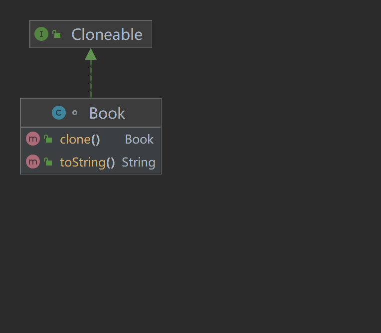

# 原型模式
## 定义
    以目标对象为原型实例，通过复制的方式创建新对象
## 使用场景：
    1. 创建对象时会消耗很多的资源。可以通过原型模式避免这些消耗。
    2. 创建对象时，需要做大量的对象内部的数据准备时。
    3. 客户端需要快速生成拥有相同属性的多个实例对象时。
## 拷贝介绍
    1. 浅拷贝：基本数据类型互不干扰，两个引用数据类型引用，指向内存中同一个对象。
    2. 深拷贝：在内存中生成一个内容一模一样的引用数据对象。原型对象和生成对象互不干扰。

## 使用步骤：
    1. 继承实现Clone接口
    2. 基本数据类型可以不用在意
    3. 引用数据类型，可以根据需求。自行实现深拷贝或者浅拷贝（默认即浅拷贝）
## 实现代码
```java
/**
 * @author：TianLong
 * @date：2022/10/18 19:47
 * @detail：原型模式 具体实现类
 */
class Book implements Cloneable{
    public ArrayList<String> articles = new ArrayList<>();
    public String author = "";
    public int price = 0;
    public String publishers = "";

    public Book(ArrayList<String> articles, String author, int price, String publishers) {
        this.articles = articles;
        this.author = author;
        this.price = price;
        this.publishers = publishers;
    }

    @Override
    public Book clone() {
        Book book = null;
        try {
          book = (Book) super.clone();
          // 引用数据类型，需实现深拷贝
          book.articles = (ArrayList<String>) this.articles.clone();
        } catch (CloneNotSupportedException e) {
            throw new RuntimeException(e);
        }

        return book;
    }
    
    @Override
    public String toString() {
        return "Book{" +
                "articles=" + articles +
                ", author='" + author + '\'' +
                ", price=" + price +
                ", publishers='" + publishers + '\'' +
                '}';
    }
}

```
```java
/**
 * @author：TianLong
 * @date：2022/10/18 19:52
 * @detail：客户端
 */
class Client {
    public static void main(String[] args) {
        ArrayList<String>arrayList=new ArrayList<>();
        arrayList.add("丑小鸭");
        arrayList.add("白雪公主");
        arrayList.add("小红帽");
        Book book = new Book(arrayList,"安徒生",20,"人民出版社");
        Book cloneBook = book.clone();

        // 引用数据类型
        book.articles.add("大闹天宫");
        // 数据输出
        System.out.println(book.toString());
        System.out.println(cloneBook.toString());
    }
}
```
## UML图

## 优缺点
    1. 优点：在内存中以二进制流的方式直接拷贝对象数据。不需要new对象。
    2. 缺点：clone创建对象时，不会执行构造器函数。即是优点也是缺点。如需要实现
            某些放在构造器函数内的操作时，需要注意。
## 注意事项
    1. 原型模式，只要能达到复制对象目的即可，不一定需要实现clone接口。
    2. 基本数据类型直接复制，引用数据类型只拷贝对象引用。
    3. 若要实现引用数据类型的深拷贝，要么该引用数据类型实现clone接口，要么直接new该对象。
    4. clone接口复制时，内容直接复制，不执行构造方法。