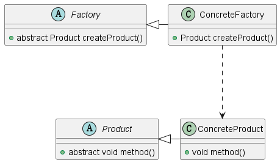

# 工厂方法模式
## 定义
    第一一个用于创建对象的接口，由子类决定具体实例化哪个类。
    工厂方法模式属于创建型设计模式。是为了将对象的创建与Client类解耦。
    工厂会返回对象给Client，Client不知道创建的具体细节。
    工厂方法模式分为四个组成部分，抽象工厂，抽象产品，具体工厂，具体产品。
## 使用场景：
    1. 有大量相同属性的同类型对象。
    2. 需要将这些对象的创建对客户端进行解耦。
## 使用步骤：
    1. 将具有相同特征的对象的共同特征进行提取。生成抽象产品类。
    2. 生成继承抽象产品的具体产品。
    3. 创建抽象工厂，生成返回抽象产品的抽象方法。
    4. 生成创建具体产品的具体工厂，该工厂继承抽象工厂。重写抽象方法，返回具体产品的对象。
## UML图


## 实现代码
##### 抽象工厂代码
```java
public abstract class Factory {
   public abstract <T extends Product> T createProduct(Class<T> clazz);
}
```
##### 抽象产品代码
```java
public abstract class Product {
    abstract void method();
}
```

##### 具体工厂代码
```java
public class ConcreteFactory extends Factory{

    // 通过反射的方式创建具体工厂，解决了，一个具体工厂对应一个具体产品的问题
    @Override
    public <T extends Product> T createProduct(Class<T> clazz) {
        Product product = null;
        try {
            product = (Product) Class.forName(clazz.getName()).newInstance();
        }catch (Exception e){
            e.printStackTrace();
        }

        return (T) product;
    }
}
```

##### 具体产品代码
```java
public class ConcreteProductA extends Product{
    @Override
    void method() {
        System.out.println("具体产品A");
    }
}

public class ConcreteProductB extends Product{
    @Override
    void method() {
        System.out.println("具体产品B");
    }
}
```

##### 客户端代码实现
```java
public class Client {
    public static void main(String[] args) {
        Factory factory = new ConcreteFactory();
        ConcreteProductA productA = factory.createProduct(ConcreteProductA.class);
        ConcreteProductB productB = factory.createProduct(ConcreteProductB.class);

        productA.method();

        productB.method();
    }
}
```
## 注意事项
1. 优点，将对象的创建与客户端代码分离实现解耦。
2. 缺点，每新增一个种类就要新增一个抽象产品和抽象工厂。
3. 提升，可以用反射的方式实现具体工厂，而不是每有一个具体产品就创建一个与之相对应的具体工厂。可以减少代码量。