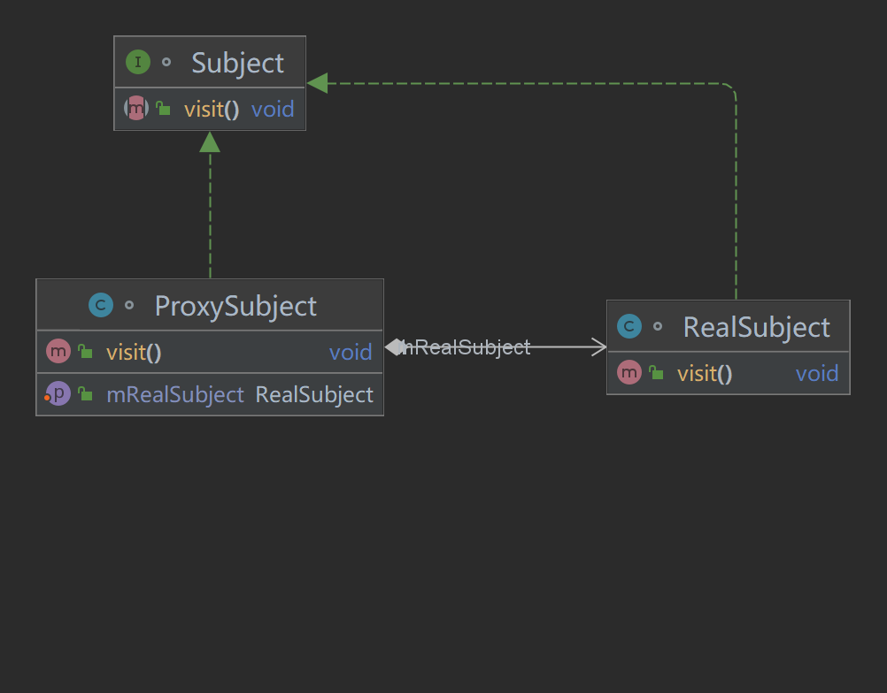

# 代理模式
## 介绍
    代理模式是结构型模式。生活中很多自己做不了的事情，拜托别人代做的
    都可以看作是代理模式。
## 定义   
    为其他对象提供一种代理，以控制该对该对象的访问。
## 使用场景
    当访问对象A存在困难，或者对象A不想被其他对象访问时，可以通过代理对象
    来实现对对象A的访问和调用。通常情况需要代理对象和被代理对象实现相同的抽象接口。
## UML

## 代码
### 实际场景
    小红的公司没给小红发工资。小红准备起诉这家公司。可是诉讼和辩诉等小红并不会也没有
    经验。所以小红决定找个律师。
### 抽象主题类
    将共通性行为抽象到抽象主题类中。此处将打官司的三种行为（提交申请，辩护，结束诉讼）进行抽象。
```java
/**
 * @author：TianLong
 * @date：2022/10/24 19:04
 * @detail：抽象主题类
 */
interface ILawyer {
    // 提交
    void submit();
    // 辩护
    void defend();
    // 结束
    void finish();
}
```
### 代理类
    代理类可以实现抽象主题类，也可以不实现抽象主题类。但是需要持有一个抽象主题的引用。
    这里律师实现了抽象接口（代理类），并持有小红的引用（抽象主题）。
```java
/**
 * @author：TianLong
 * @date：2022/10/24 19:09
 * @detail：
 */
class Lawyer implements ILawyer{
    private ILawyer mILawyer;

    public void setILawyer(ILawyer ILawyer) {
        mILawyer = ILawyer;
    }

    @Override
    public void submit() {
        mILawyer.submit();
    }

    @Override
    public void defend() {
        mILawyer.defend();
    }

    @Override
    public void finish() {
        mILawyer.finish();
    }
}
```
### 实际主题类
    真正去执行具体行为的类。需要实现抽象接口。
    这里小红需要去提交诉讼，进行辩诉，以及结束诉讼。
```java

/**
 * @author：TianLong
 * @date：2022/10/24 19:09
 * @detail：实际主题类,行为的真正是执行者
 */
class XiaoHong implements ILawyer{

    @Override
    public void submit() {
        System.out.println("小红提交诉讼");
    }

    @Override
    public void defend() {
        System.out.println("小红辩诉");
    }

    @Override
    public void finish() {
        System.out.println("小红案件结束");
    }
}
```
### 客户端
    小红找律师帮助自己。法院大多数时候都是在和律师进行沟通。
```java
/**
 * @author：TianLong
 * @date：2022/10/24 19:09
 * @detail：实际主题类,行为的真正是执行者
 */
class XiaoHong implements ILawyer{

    @Override
    public void submit() {
        System.out.println("小红提交诉讼");
    }

    @Override
    public void defend() {
        System.out.println("小红辩诉");
    }

    @Override
    public void finish() {
        System.out.println("小红案件结束");
    }
}
```
## 注意事项
1. 代理模式的应用很广泛，Android中的AIDL跨进程通信就是一种代理机制。
2. 它的最大的缺点可能就是会使类增加。