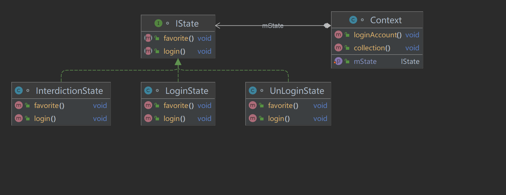

# 状态模式
## 介绍
    状态模式是一种行为型模式，不同的状态会有不同的行为。

## 定义：
    当一个对象的状态改变时，允许改变其行为。

## 使用场景
    1.一个对象的行为取决于它的状态，根据它的状态改变它的行为。
    2.代码中包含大量的与状态有关的条件语句时，if—else或switch。

## UML图


## 业务场景
    实现淘宝的登录和收藏功能。用户有三种登录状态，已登录，未登录，账号被封。
    三种状态下登录账号和收藏商品的功能
### 普通业务代码示例
    通过条件语句来实现不同状态下的不同操作。该实现方法耦合度高，条件语句太多，每次
    修改业务就需要修改Client源码。
```java
/**
 * @author：TianLong
 * @date：2022/10/18 20:53
 * @detail：传统实现方式
 */
class StateDemo {
    public static void main(String[] args) {
        Client client = new Client();
        client.loin();
        client.favorite();
    }


    public static class Client {
        private static final int UN_LOGIN_STATE = 0;
        private static final int LOGIN_STATE = 1;
        private static final int INTERDICTION_STATE = 2;

        public int state = UN_LOGIN_STATE;
        /**
         * 登录方法
         */
        public void loin() {
            switch (state) {
                case LOGIN_STATE:
                    System.out.println("账号已登录，无需再次登录");
                    break;

                case INTERDICTION_STATE:
                    System.out.println("账号被封,请先解封");
                    // 账号解封业务操作
                    break;

                default:
                    System.out.println("账号尚未登录，请先登录");
                    // 登录账号操作，如果登录成功，改变state状态
                    state = LOGIN_STATE;
                    System.out.println("账号登录成功");
                    break;
            }
        }

        /**
         * 收藏
         */
        public void favorite() {
            switch (state) {
                case LOGIN_STATE:
                    System.out.println("收藏商品成功");
                    break;

                case INTERDICTION_STATE:
                    System.out.println("账号被封,请先解封");
                    break;

                default:
                    System.out.println("账号尚未登录，请先登录");
                    break;

            }
        }
    }
}
```
### 状态模式代码示例
    将相同业务的方法抽象成抽象方法
    具体实现类实现抽象方法，内部的逻辑不同
    环境类持有抽象类视为环境类的状态。通过修改环境类状态，来修改环境类的具体行为。
#### 抽象类
```java
/**
 * @author：TianLong
 * @date：2022/10/18 20:52
 * @detail：状态模式抽象类
 */
interface IState {
    public static final int UN_LOGIN_STATE = 0;
    public static final int LOGIN_STATE = 1;
    public static final int INTERDICTION_STATE = 2;

     void favorite();

     void login();
}
```
#### 三种具体实现类
```java
/**
 * @author：TianLong
 * @date：2022/10/18 21:16
 * @detail：具体实现类，封号状态
 */
class InterdictionState implements IState {
    @Override
    public void favorite() {
        System.out.println("账号被封,请先解封");
    }

    @Override
    public void login() {
        System.out.println("账号被封,请先解封");
    }
}
```
```java
/**
 * @author：TianLong
 * @date：2022/10/18 21:13
 * @detail：具体实现类，登录状态
 */
class LoginState implements IState {
    @Override
    public void favorite() {
        System.out.println("收藏商品成功");
    }

    @Override
    public void login() {
        System.out.println("账号已登录，无需再次登录");
    }
}
```
```java
/**
 * @author：TianLong
 * @date：2022/10/18 21:14
 * @detail：具体实现类，未登录状态
 */
class UnLoginState implements IState {

    @Override
    public void favorite() {
        System.out.println("账号尚未登录，请先登录");
    }

    @Override
    public void login() {
        System.out.println("账号尚未登录，请先登录");
    }
}
```
#### 环境类
```java
/**
 * @author：TianLong
 * @date：2022/10/18 21:12
 * @detail：环境类，维护状态变化，对外提供功能
 */
class Context  {
    // 默认复制为未登录状态
    private IState mState = new UnLoginState();

    public void setState(IState state) {
        this.mState = state;
    }

    public void collection() {
        mState.favorite();
    }

    public void loginAccount() {
        mState.login();
    }
}
```
#### 客户端
```java
/**
 * @author：TianLong
 * @date：2022/10/18 21:26
 * @detail：客户类
 */
class Client {
    public static void main(String[] args) {
        Context context = new Context();
        context.loginAccount();

        // 登录，改变状态
        context.setState(new LoginState());

        context.loginAccount();
        context.collection();
    }
}
```
## 注意事项
    状态模式和策略模式极其相似。
    策略模式：策略模式重在整个算法的替换，也就是策略的替换
    状态模式：修改环境类的状态，来改变环境类的具体行为。