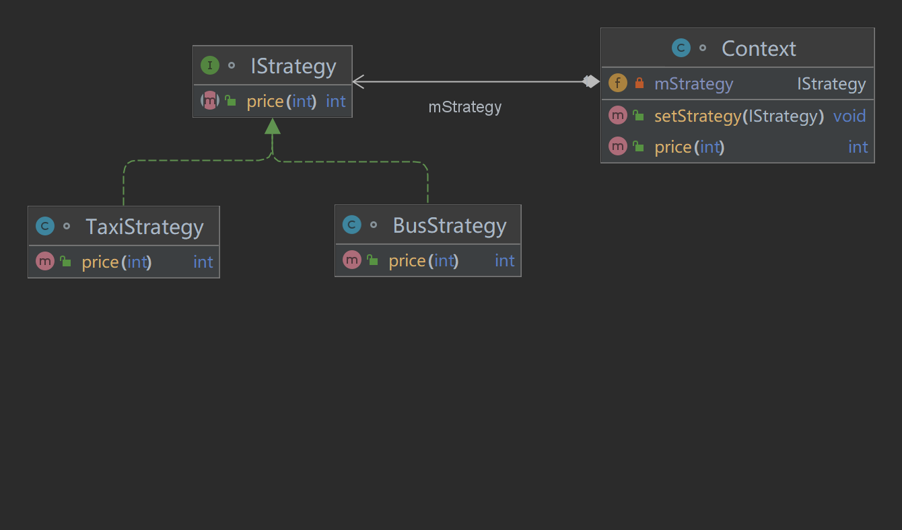

# 策略模式
## 介绍
    将一种行为或者解决方案封装成一个算法。
    该算法有不同种实现方式即多种策略。通过传入不同策略以达到想要的效果。
## 定义
    策略模式将算法抽象出来，并通过算法的不同实现封装成不同的策略。
    使他们之间可以互相替换。且将调用者和具体算法进行分离解耦。
    
## 使用步骤
    将同一种行为或者算法进行抽象。具体实现类实现该接口或者抽象类。
    调用端要求传入参数为抽象类。
    通过传入不同的具体实现类，来达成切换策略的效果。
## 使用场景
    假设你要行去5公里外剧本杀，现在你有两种选择，一种是打车每公里5元。另一种是做公交每公里2元。
### 传统的实现方式
    传统实现方式，使用if-else，通过传参不同来控制计算方法。
```java
/**
 * @author：TianLong
 * @date：2022/10/14 19:25
 * @detail：传统实现方式
 */
class StrategyDemo {
    private static final int BUS = 0;
    private static final int TAXI = 1;
    public static void main(String[] args) {
        StrategyDemo strategyDemo  = new StrategyDemo();
        int busPrice = strategyDemo.price(BUS,5);
        int taxiPrice = strategyDemo.price(TAXI,5);
        
        System.out.println("公交车5km价格："+busPrice);
        System.out.println("出租车5km价格："+taxiPrice);
    }

    public int price(int type,int distance){
        int price = 0;
        if (type == BUS){
            price = 2 * distance;
        }else if (type == TAXI){
            price = 5 * distance;
        }else {
            // 其他方式，此处省略...
        }

        return price;
    }
}
```
### 策略类实现方式
    将计算方法抽象成接口。不同的出行方式通过继承接口成为策略的具体实现类。
    通过修改客户端传入的策略来达到不同的效果。
#### 抽象策略类
```java
/**
 * @author：TianLong
 * @date：2022/10/14 19:07
 * @detail：抽象策略类
 */
interface PriceStrategy {
    int price(int distance);
}
```
```java
/**
 * @author：TianLong
 * @date：2022/10/14 19:10
 * @detail：具体策略实现类
 */
class BusStrategy implements PriceStrategy{
    @Override
    public int price(int distance) {
        return distance * 2 ;
    }
}
```
```java
/**
 * @author：TianLong
 * @date：2022/10/14 19:12
 * @detail：具体策略实现类
 */
class TaxiStrategy implements PriceStrategy{

    @Override
    public int price(int distance) {
        return distance * 5;
    }
}

```
```java
/**
 * @author：TianLong
 * @date：2022/10/14 19:13
 * @detail：客户端，将策略抽离客户端实现。修改策略具体实现或者新增策略时，不涉及客户端的修改。
 */
class Client {
    public static void main(String[] args) {
        Client client = new Client();
        int busPrice = client.setStrategy(new BusStrategy(),5);
        int taxiPrice = client.setStrategy(new TaxiStrategy(),5);

        System.out.println("公交车5km价格："+busPrice);
        System.out.println("出租车5km价格："+taxiPrice);
    }

    public int setStrategy(PriceStrategy priceStrategy,int distance){
        return priceStrategy.price(distance);
    }
}
```
## 策略模式UML


## 策略模式的优点
    将策略抽离客户端。实现客户端和策略的解耦。
    修改策略具体实现或者新增策略时，不涉及客户端的修改。
    可以在特定情况下减少if else 的嵌套
## 六大原则
    符合迪米特法则（一个类应尽量少的和其他类相互作用）
    符合开闭原则（对扩展开放，对修改关闭）
    符合依赖倒转原则（面向接口编程而不是面向实现编程）
    符合里氏替换（任何基类出现的地方都可以用子类来替换）