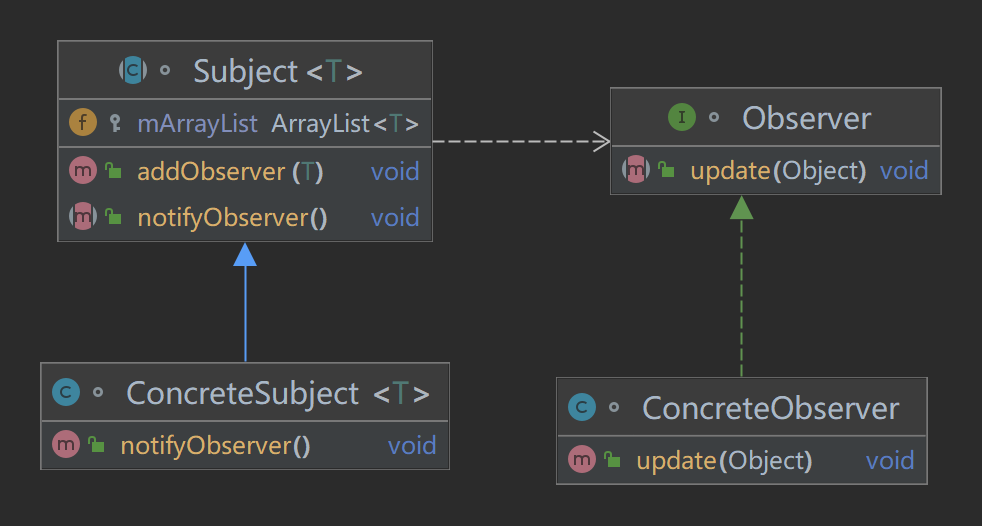

# 观察者模式
## 介绍
    非常常用的一种行为设计模式。目的是将观察者和被观察者解耦。
## 定义
    定义对象之间一种一对多的关系。一旦对象状态发生改变，所有依赖于它的对象，都会得到
    相应的通知。
## 使用场景
1. 关联场景
2. 事件多级触发场景
3. 跨系统的消息交换场景，如Android的消息机制。
## UML

## 代码
### 场景
    由于公司老板，技术总监，以及人力总监朱狗不如的不作为，一家名为华捷艾米的公司终于发不出来工资了
    很多员工被欠薪，离职。有几名员工通过仲裁的方式，向法院提起诉讼。这家公司决定，如果有钱的情况下
    就会通知员工发工资。
#### 抽象主题，被观察者类
```java
/**
 * @author：TianLong
 * @date：2022/10/20 0:59
 * @detail：抽象主题类，即被观察者类
 */
abstract class Observable<T extends Observer> {
    protected ArrayList<T> mArrayList = new ArrayList<>();
    public void addObserver(T t){
        mArrayList.add(t);
    }
    
    public abstract void notifyObserver();
}
```
#### 实际主题类，被观察者类，即这家公司
```java
/**
 * @author：TianLong
 * @date：2022/10/20 1:03
 * @detail：具体主题类，即真正的被观察者类
 */
class HJIMI<T extends Observer> extends Observable<T>{
    @Override
    public void notifyObserver() {
        for (T t:mArrayList){
            t.takeMoney(t);
        }
    }
}
```
#### 抽象观察者类
```java

/**
 * @author：TianLong
 * @date：2022/10/20 1:00
 * @detail：抽象观察者类
 */
interface Observer {
    void takeMoney(Object o);
}
```
#### 实际观察者类，欠薪员工
```java
/**
 * @author：TianLong
 * @date：2022/10/20 1:05
 * @detail：实际观察者类，欠薪员工
 */
class MrJia implements Observer{
    @Override
    public void takeMoney(Object o) {
        System.out.println("终于还给MrJia工资了");
    }
}
class MrsCheng implements Observer{
    @Override
    public void takeMoney(Object o) {
        System.out.println("终于还给MrsCheng工资了");
    }
}
class MrsHao implements Observer{
    @Override
    public void takeMoney(Object o) {
        System.out.println("终于还给MrsHao工资了");
    }
}

```
#### 客户端
```java
/**
 * @author：TianLong
 * @date：2022/10/20 1:08
 * @detail：客户类
 */
class Client {
    public static void main(String[] args) {
        // 欠薪公司
        HJIMI<Observer> hjimi = new HJIMI<>();

        // 欠薪员工
        MrJia jia = new MrJia();
        MrsCheng cheng = new MrsCheng();
        MrsHao hao = new MrsHao();

        // 通过劳动监察，公司终于答应，有钱就告诉我们
        hjimi.addObserver(jia);
        hjimi.addObserver(cheng);
        hjimi.addObserver(hao);

        // 过了很久很久，公司破产的前夕
        hjimi.notifyObserver();
    }
}
```
## 注意事项
1. 优点：观察者模式的作用就是对象的解耦。让观察者和被观察者完全隔离。只依赖于Observer和Observable的抽象。
2. 缺点：被观察者中持有的观察者数量一旦增多，其中一个发生卡顿，剩下的观察者都需要等待。
