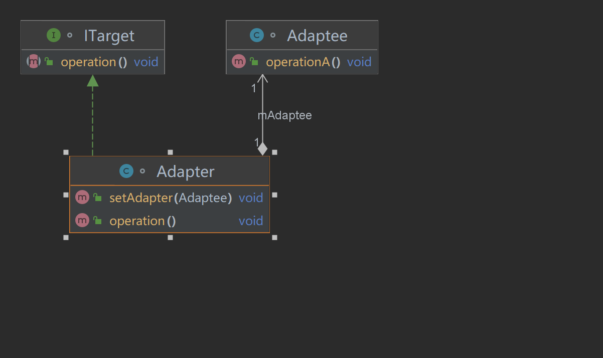

# 适配器模式
## 介绍
    生活中我们的家里插座的电压是220V，但是我们的家电所需的电压却并不是220V，手机可能是5V的，
    平板可能是10V的，笔记本电脑可能是14V，台式机电脑可能是220V。为了使他们能够正常使用，我们的电子产品出场时就自带适配器。
    将我们的生活电压转换成自身需要的电压。
    而编程中，我们将本就存在的被适配器类的接口通过一个适配器类转换成目标客户需要的接口，这就是适配器模式。
## 定义
    适配器就是将一个类的API通过适配器的转换，变成客户端需要的API接口。
## 使用场景
1. 已存在一个功能类，但是此类的接口与需要它的功能的目标类接口不一致（接口不兼容）。
2. 需要一个统一的输出接口，但是输入端不可知。
## UML图
### 适配器模式角色
    1. 目标类：最终需要实现的类的接口
    2. 被适配类：存在目标类需求的功能，但是该功能的接口和目标类需求的接口不一致
    3. 适配类：将被适配类的接口进行转换，最终实现目标类的接口

## 代码
### 需求
    2022年，最新的iphone14和华为mate50发布了，小明开开心心的个买了一部，并拍了很多好看的照片。买完后他想把两
    个手机里的照片传输到电脑上，但是电脑只能插USB接口。可是苹果手机使用的是Lighting接口，华为手机使用的是TypeC接口。
    没办法直接将数据从手机上传输到电脑上，这时候有人跟他说，可以买两条数据线。
### 具体代码
#### 目标类
```java
/**
 * @author：TianLong
 * @date：2022/10/19 17:17
 * @detail：电脑需要的是USB接口
 */
interface IComputer {
    String USB();
}

```
#### 被适配类
```java
/**
 * @author：TianLong
 * @date：2022/10/19 17:18
 * @detail：被适配类，苹果提供的接口是Lightning
 */
class IPhone14Pro {
    public String Lightning(){
        return "Lightning";
    }
}
```
```java
/**
 * @author：TianLong
 * @date：2022/10/19 17:18
 * @detail：被适配类，华为只能提供typeC接口
 */
class HwMate50Pro {
    public String typeC(){
        return "type-C";
    }
}
```
#### 适配器类
```java
/**
 * @author：TianLong
 * @date：2022/10/19 17:19
 * @detail：适配器类，iphone的Lighting数据线
 */
class IphoneAdapter implements IComputer{
    private IPhone14Pro iphone;

    public void setAdapter(IPhone14Pro iphone){
        this.iphone = iphone;
    }
    @Override
    public String USB() {
        String port = iphone.Lightning();
        return "将Iphone的"+port+"转成USB接口";
    }
}
```
```java
/**
 * @author：TianLong
 * @date：2022/10/19 17:27
 * @detail：适配器类，华为的TypeC数据线
 */
class HwAdapter implements IComputer{
    private HwMate50Pro mate50Pro;

    public void setAdapter(HwMate50Pro mate50Pro) {
        this.mate50Pro = mate50Pro;
    }

    @Override
    public String USB() {
        String port = mate50Pro.typeC();
        return "将华为的"+port+"转成USB接口";
    }
}
```
```java
/**
 * @author：TianLong
 * @date：2022/10/19 17:28
 * @detail：客户端类
 */
class Client {
    public static void main(String[] args) {
        // 通过适配器，将Lighting转换成USB接口
        IPhone14Pro iPhone14Pro = new IPhone14Pro();
        IphoneAdapter iphoneAdapter = new IphoneAdapter();
        iphoneAdapter.setAdapter(iPhone14Pro);
        System.out.println(iphoneAdapter.USB());

        // 通过适配器，将typeC转换成USB
        HwMate50Pro hwMate50Pro = new HwMate50Pro();
        HwAdapter hwAdapter = new HwAdapter();
        hwAdapter.setAdapter(hwMate50Pro);
        System.out.println(hwAdapter.USB());
    }
}
```
#### 代码中角色
    目标类：电脑只有USB接口
    被适配类：苹果手机是Lighting接口，华为手机是TypeC接口。都无法和电脑相连
    适配器类：通过Lighting数据线可以将Lighting接口和USB接口相连。
            通过TypeC数据线可以将华为手机TypeC接口和USB接口相连。

## 注意事项
    优点：更好的复用性，可以将原本不兼容的接口融合在一起。
    缺点：过多的使用适配器类会让代码可读性变差。（比如明明调用的是A类的接口，但是内部将其转换成了B类的接口）